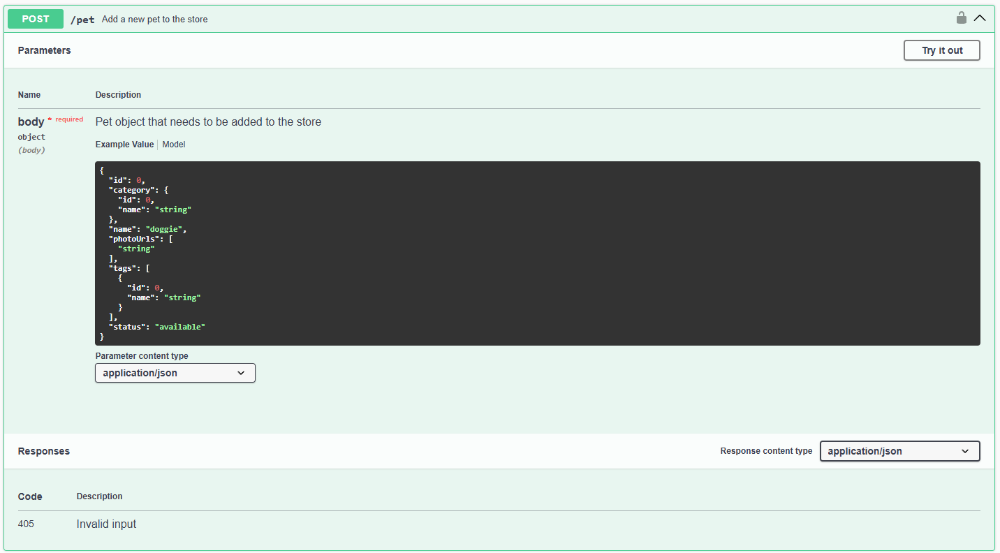
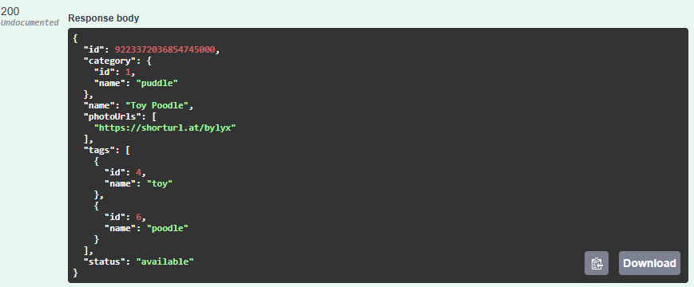
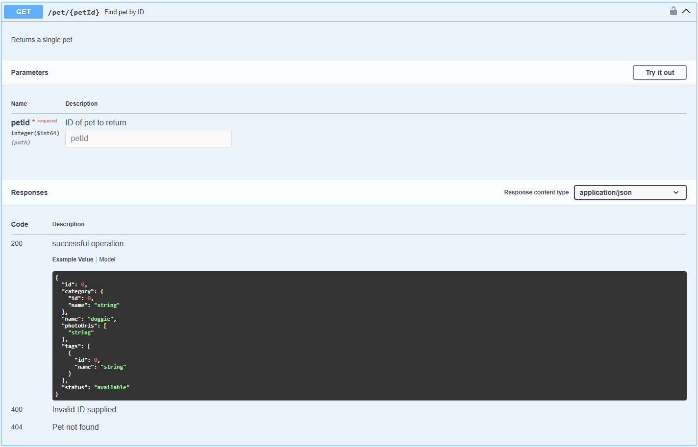
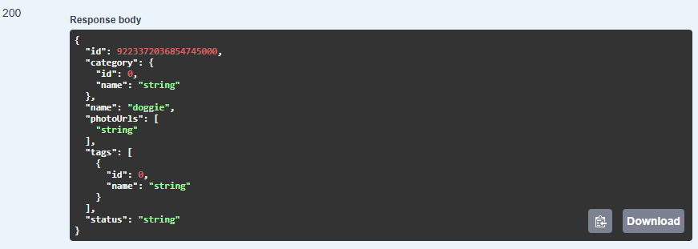
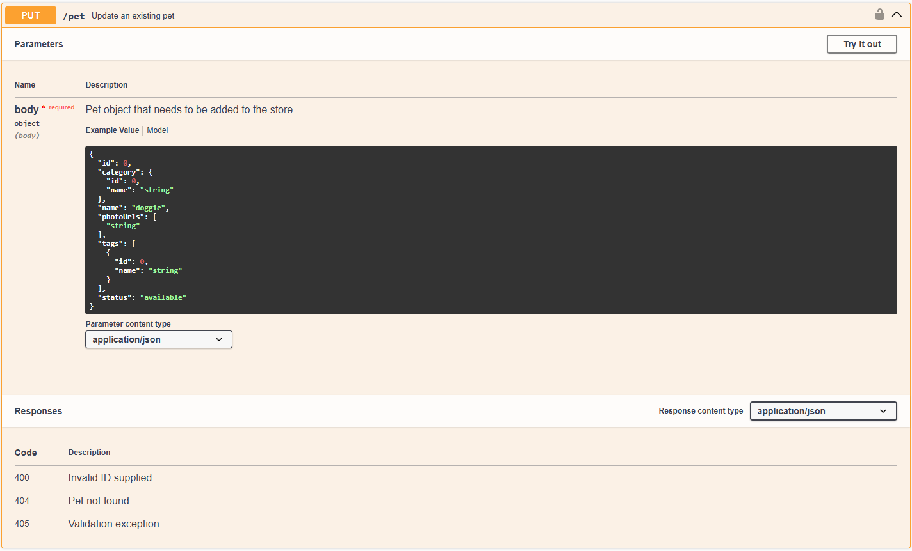
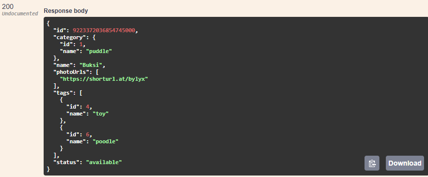
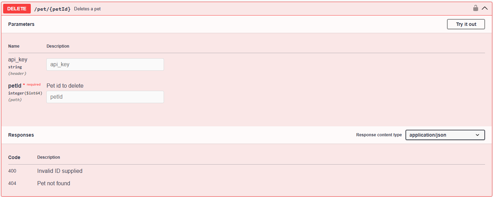
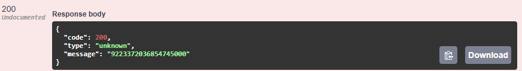

# Bevezetés

Ez az útmutató bemutatja, hogyan lehet új kisállatot létrehozni, lekérdezni, módosítani és törölni a Petstore API segítségével. Az útmutató lépésről lépésre vezet végig a folyamaton.

# Gyors áttekintés
| Lépés | Funkció                                 | Végpont             | Link |
|-------|-----------------------------------------|---------------------|----------|
| 1.    | Új kisállat létrehozása                | `POST /pet`         | https://petstore.swagger.io/#/pet/addPet |
| 2.    | Kisállat adatainak lekérdezése          | GET /pet/&#123;petId&#125;  | https://petstore.swagger.io/#/pet/getPetById |
| 3.    | Kisállat adatainak frissítése           | `PUT /pet`          | https://petstore.swagger.io/#/pet/updatePet |
| 4.    | Kisállat törlése                        | `DELETE /pet/&#123;petId&#125;`| https://petstore.swagger.io/#/pet/deletePet |


# Feladatok

## 0. Előkészületek
1. Nyisd meg a https://petstore.swagger.io/ oldalt.

## 1. Új kisállat (Pet) létrehozása
1. Tekerj az oldalon a `POST /pet` parancshoz.
1. Nyisd le a parancsot a sor végén található nyíllal. Egy ehhez hasonló felületet látsz majd:

1. A `Parameters` rész alatt láthatod a kérés törzsét. Itt találsz egy példa bemenetet és a bemenet felépítését bemutató modellt is. A legördülő menüből kiválaszthatod, hogy json vagy xml formátumban szeretnéd beküldeni a kérés törzsét.
1. A paraméterek alatt találod a `Responses` részt, ami a lehetséges válaszkódokat sorolja fel. Az érvénytelen bemenetre `405 Invalid input` választ ad az oldal. Az érvényes bemenetre adott válasz itt nincs dokumentálva, de az egyezményes válasz a `200 OK`.
1. Próbáld ki a parancsot! Ehhez tekerj vissza a kérés elejére és kattints a szürke `Try it out` gombra. Ez a gomb szerkeszthetővé teszi a kérés paramétereit, jelen esetben a kérés törzsét.
1. Másold be a következő kódot a szerkeszthető mezőbe:
```json
{
  "id": 0,
  "category": {
    "id": 1,
    "name": "puddle"
  },
  "name": "Toy Poodle",
  "photoUrls": [
    "https://shorturl.at/bylyx"
  ],
  "tags": [
    {
      "id": 4,
      "name": "toy"
    },
    {
      "id": 6,
      "name": "poodle"
    }
  ],
  "status": "available"
}
```
>**TIPP**
>- Az `id` értéke - API konfigurációtól függően - lehet `0`, egy konkrét érték, vagy lehet, hogy meg sem kell adni. A példában az `id` értékét `0`-n hagytuk.
>- A `category` és a `tags` résznél olyan `id`-kat adtunk meg, amikről tudjuk, hogy létezik. Ha nem létező `id`-t adsz meg, előfordulhat, hogy az API hibát ad vissza rá - vagy létre is hozhatja új objektumként. 
>- A photo URL-t a [shorturl](https://www.shorturl.at/shortener.php) segítségével rövidítettem le.<br></br>
7. Ellenőrizd, hogy az adatok és a formázás is helyes, majd kattints az `Execute` gombra.
1. A gomb alatt megjelenik egy curl parancs és a request URL - ez az, amit beküldtél a szervernek. Ez alatt láthatod a visszakapott választ:

1. A `200`-as válasz azt jelenti, hogy sikeresen létrehoztad a kisállatodat.

## 2. Létrehozott kisállat adatainak lekérdezése: (GET /pet/&#123;petId&#125;)
1. Keresd meg az oldalon a **GET /pet/&#123;petId&#125;** kérést, és nyisd le a sor végén található nyíllal. Egy ehhez hasonló felületet látsz majd:

1. A `Parameters` rész alatt láthatod a kérésnek megadható paramétereket. A GET /pet/&#123;petId&#125; kérés kötelezően egy számot vár `petId`-nak.
1. A paraméterek alatt, a `Responses` részben több lehetséges választ is láthatsz:
    - `200 OK`, ha minden rendben volt,
    - `400 Invalid ID supplied`, ha érvénytelen `petId`-t adtál meg,
    - `404 Pet not found`, ha olyan kisállatot akartál lekérdezni, ami nincs a rendszerben.
1. Kattints a szürke `Try it out` gombra, hogy szerkeszthetővé tedd a kérés paramétereit.
1. Írd be a `petId` mezőbe az előbb létrehozott kisállat `id`-ját.
1. Kattints az `Execute` gombra.
1. A gomb alatt megjelenik egy curl parancs és a request URL - ez az, amit beküldtél a szervernek. Ez alatt láthatod a visszakapott választ:

1. A `200`-as válasz azt jelenti, hogy sikeresen lekérdezted a kisállat adatait.
>**TIPP**
>- Mivel ez egy tesztkörnyezet, valószínűleg nem a saját kisállatodat fogod visszakapni. Próbáld ki, hogy telepíted magadnak a rendszert lokálisan, ott már konzisztensek maradnak az adatok!

## 3. Kisállat adatainak frissítése: (PUT /pet)
1. Keresd meg az oldalon a **PUT /pet** kérést, és nyisd le a sor végén található nyíllal. Egy ehhez hasonló felületet látsz majd:

1. A `Parameters` rész alatt láthatod a kérés törzsét. Itt találsz egy példa bemenetet és a bemenet felépítését bemutató modellt is. A legördülő menüből kiválaszthatod, hogy json vagy xml formátumban szeretnéd beküldeni a kérés törzsét.
1. Kattints a szürke `Try it out` gombra, hogy szerkeszthetővé tedd a kérés törzsét.
1. Használd fel az első feladatra válaszul kapott adatokat, majd módosítsd a `name` értékét "Buksi"-ra:
```json
{
  "id": 9223372036854745000,
  "category": {
    "id": 1,
    "name": "puddle"
  },
  "name": "Buksi",
  "photoUrls": [
    "https://shorturl.at/bylyx"
  ],
  "tags": [
    {
      "id": 4,
      "name": "toy"
    },
    {
      "id": 6,
      "name": "poodle"
    }
  ],
  "status": "available"
}
```
>**TIPP**
>- Mivel ez egy tesztkörnyezet, valószínűleg nem a saját kisállatodat fogod visszakapni. Próbáld ki, hogy telepíted magadnak a rendszert lokálisan, ott már konzisztensek maradnak az adatok!
>- Ha valamilyen adatot üresen hagysz - például nem adsz meg `photoUrls`-t - , akkor előfordulhat, hogy az API felülírja vele a már letárolt értéket, vagyis törli a `photoUrls` értékét.
5. Ha minden adattal elégedett vagy, kattints az `Execute` gombra.
1. A gomb alatt megjelenik egy curl parancs és a request URL - ez az, amit beküldtél a szervernek. Ez alatt láthatod a visszakapott választ, amiben már "Buksi" szerepel a `name` értékeként:

1. A `200`-as válasz azt jelenti, hogy sikeresen módosítottad a kisállat adatait.

## 4. Kisállat törlése: (DELETE /pet/&#123;petId&#125;)
1. Keresd meg az oldalon a **DELETE /pet/&#123;petId&#125;** kérést, és nyisd le a sor végén található nyíllal. Egy ehhez hasonló felületet látsz majd:

1. A `Parameters` rész alatt láthatod a kérés paramétereit. Ennek a kérésnek két paramétert lehet megadni: az `api_key` szöveget és a `petId` számot.
1. Kattints a szürke `Try it out` gombra, hogy szerkeszthetővé tedd a kérés törzsét.
1. Másold ki az első feladatban kapott válaszból az `id` értékét, és írd a `petId`-ba. Az `api_key` kitöltése nem kötelező, azt hagyd üresen.
>**TIPP**
>- Mivel ez egy tesztkörnyezet, nem biztos, hogy a saját kisállatod `petId`-ja létezik a rendszerben. Próbálkozz nyugodtan különböző `petId`-kkal, hogy teszteld a működést.
1. Az adatok megadása után kattints az `Execute` gombra.
1. A gomb alatt megjelenik egy curl parancs és a request URL - ez az, amit beküldtél a szervernek. Ez alatt láthatod a visszakapott választ:

1. A `200`-as válasz azt jelenti, hogy sikeresen törölted a kisállatot.

# Összegzés
Az útmutató végivezetett, hogy hogyan kell kisállatot létrehozni, lekérdezni, módosítani és törölni. <br></br>
Ha szeretnéd a saját kisállataidat viszontlátni, próbáld ki a [lokális Petstore API](https://guide.link)-t.

# Következő lépések
- [Hogyan telepítsem a saját gépemre a Petstore API-t?](https://guide.link)
- Olvasd el a [Petstore API dokumentációját](https://learn.openapis.org/examples/v3.0/petstore.html)

---

